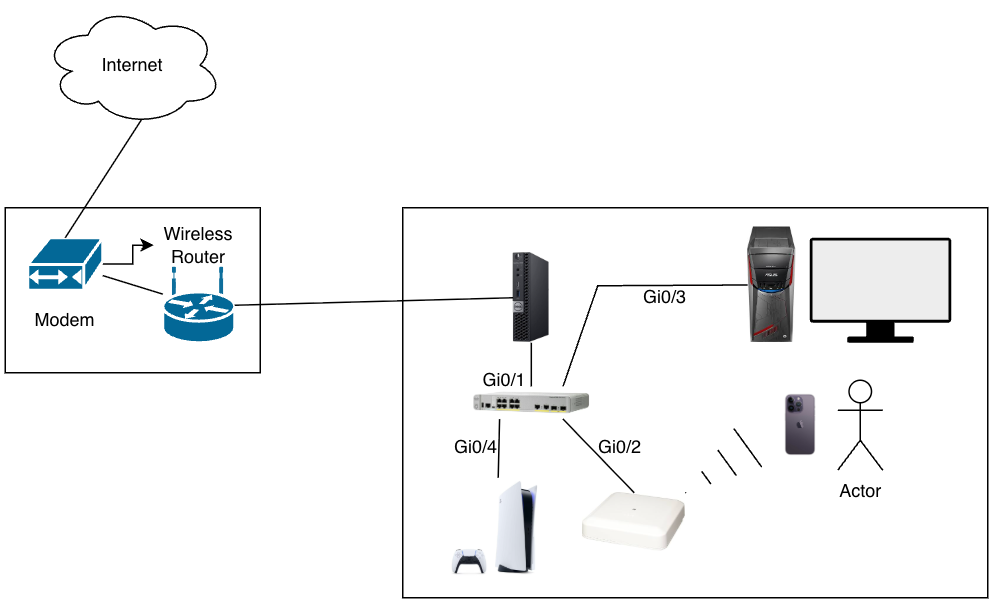

 
<h1> Proxmox Homelab (HodgeMox) </h1>
  

    <b> Mini home network built to self-host a media server and turn my home network into a hands on learning enviorment. Practicing virtualization, Linux management, Cisco Routing, and more. </b>
  

<h2> Hardware </h2>
<ul>
 <li>
  <b> Dell Optiplex 7060 Micro </b>
    i5-8500 | 16GB DDR4 | 512GB
 </li>
 <li>
  <b> Cisco Catalyst 3560CX-8PC-S </b>
    8-Port Gigabit | POE | Layer 3 Switch
 </li>
 <li>
  <b> Cisco AIR-AP2802I-B-K9 </b>
    802.11ac | Enterprise Access Point
 </li>
</ul>
  
